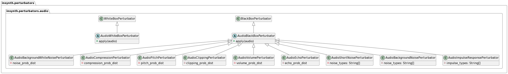

# Audio Perturbators


All audio-specific perturbators derive from the `BlackboxAudioPerturbator` class. They take a numpy array (audio signal)
and the sample rate as input and return a numpy array (perturbed audio signal).

## AudioBackgroundWhiteNoisePerturbator

The AudioBackgroundWhiteNoisePerturbator adds white noise to the input signal.

### Usage

```python
from insynth.perturbators.audio import AudioBackgroundWhiteNoisePerturbator
import librosa
from scipy.stats import norm

perturbator = AudioBackgroundWhiteNoisePerturbator(noise_prob=norm, noise_prob_args={'loc': 0.2, 'scale': 0.2})
audio, sample_rate = librosa.load('audio.wav')
perturbed_im = perturbator.apply((audio, sample_rate))
```

### Result

[Background White Noise](../audio/background_noise.wav)

## AudioCompressionPerturbator

The AudioCompressionPerturbator adds compression artifacts to the input signal.

### Usage

```python
from insynth.perturbators.audio import AudioCompressionPerturbator
import librosa
from scipy.stats import norm

perturbator = AudioCompressionPerturbator(compression_prob=norm, compression_prob_args={'loc': 80, 'scale': 40})
audio, sample_rate = librosa.load('audio.wav')
perturbed_im = perturbator.apply((audio, sample_rate))
```

### Result

[Compression](../audio/compression.wav)

## AudioPitchPerturbator

The AudioPitchPerturbator changes the pitch of the input signal.

### Usage

```python
from insynth.perturbators.audio import AudioPitchPerturbator
import librosa
from scipy.stats import norm

perturbator = AudioPitchPerturbator(pitch_prob=norm, pitch_prob_args={'loc': 0, 'scale': 8})
audio, sample_rate = librosa.load('audio.wav')
perturbed_im = perturbator.apply((audio, sample_rate))
```

### Result

[Pitch](../audio/pitch.wav)

## AudioClippingPerturbator

The AudioClippingPerturbator clips the input signal.

### Usage

```python
from insynth.perturbators.audio import AudioClippingPerturbator
import librosa
from scipy.stats import norm

perturbator = AudioClippingPerturbator(clipping_prob=norm, clipping_prob_args={'loc': 20, 'scale': 30})
audio, sample_rate = librosa.load('audio.wav')
perturbed_im = perturbator.apply((audio, sample_rate))
```

### Result

[Clipping](../audio/clipping.wav)

## AudioVolumePerturbator

The AudioVolumePerturbator changes the volume of the input signal.

### Usage

```python
from insynth.perturbators.audio import AudioVolumePerturbator
import librosa
from scipy.stats import norm

perturbator = AudioVolumePerturbator(volume_prob=norm, volume_prob_args={'loc': 0, 'scale': 10})
audio, sample_rate = librosa.load('audio.wav')
perturbed_im = perturbator.apply((audio, sample_rate))
```

### Result

[Volume](../audio/volume.wav)

## AudioEchoPerturbator

The AudioEchoPerturbator adds echo to the input signal.

### Usage

```python
from insynth.perturbators.audio import AudioEchoPerturbator
import librosa
from scipy.stats import norm

perturbator = AudioEchoPerturbator(echo_prob=norm, echo_prob_args={'loc': 0.3, 'scale': 0.1})
audio, sample_rate = librosa.load('audio.wav')
perturbed_im = perturbator.apply((audio, sample_rate))
```

### Result

[Echo](../audio/echo.wav)

## AudioShortNoisePerturbator

The AudioShortNoisePerturbator adds short background noise to the input signal.

### Usage

```python
from insynth.perturbators.audio import AudioShortNoisePerturbator
import librosa

perturbator = AudioShortNoisePerturbator()
audio, sample_rate = librosa.load('audio.wav')
perturbed_im = perturbator.apply((audio, sample_rate))
```

### Result

[Short Noise](../audio/short_noise.wav)

## AudioBackgroundNoisePerturbator

The AudioBackgroundNoisePerturbator adds background noise to the input signal.

### Usage

```python
from insynth.perturbators.audio import AudioBackgroundNoisePerturbator
import librosa

perturbator = AudioBackgroundNoisePerturbator()
audio, sample_rate = librosa.load('audio.wav')
perturbed_im = perturbator.apply((audio, sample_rate))
```

### Result

[Background Noise](../audio/background_noise.wav)

## AudioImpulseResponsePerturbator

The AudioImpulseResponsePerturbator convolves the input signal with an impulse response.

### Usage

```python
from insynth.perturbators.audio import AudioImpulseResponsePerturbator
import librosa

perturbator = AudioImpulseResponsePerturbator()
audio, sample_rate = librosa.load('audio.wav')
perturbed_im = perturbator.apply((audio, sample_rate))
```

### Result

[Impulse Response](../audio/impulse_response.wav)