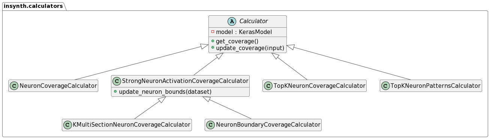

# Calculators

Calculators are responsible for calculating a specific coverage criteria for the model under test.

*InSynth* provides a set of concrete calculator implementations which are all based on the abstract `Calculator` class.



Each calculator has to be instantiated for a specific model. Then, the `update_coverage` method can be called which
updates the internal coverage dictionaries in the calculator. After that is done for all elements in the dataset,
the `get_coverage` method can be called to retrieve the coverage.

## NeuronCoverageCalculator

The NeuronCoverageCalculator determines the neuron coverage of the model.

### Usage

```python
from insynth.calculators import NeuronCoverageCalculator

calculator = NeuronCoverageCalculator(model_to_test)
calculator.update_coverage(test_case)
print(calculator.get_coverage())
```

## StrongNeuronActivationCoverageCalculator

The StrongNeuronActivationCoverageCalculator determines the strong neuron activation coverage of the model.

### Usage

```python
from insynth.calculators import StrongNeuronActivationCoverageCalculator

calculator = StrongNeuronActivationCoverageCalculator(model_to_test)
calculator.update_neuron_bounds(training_dataset)
calculator.update_coverage(test_case)
print(calculator.get_coverage())
```

## KMultiSectionNeuronCoverageCalculator

The KMultiSectionNeuronCoverageCalculator determines the k-multi-section neuron coverage of the model.

### Usage

```python
from insynth.calculators import KMultiSectionNeuronCoverageCalculator

calculator = KMultiSectionNeuronCoverageCalculator(model_to_test)
calculator.update_neuron_bounds(training_dataset)
calculator.update_coverage(test_case)
print(calculator.get_coverage())
```

## NeuronBoundaryCoverageCalculator

The NeuronBoundaryCoverageCalculator determines the neuron boundary coverage of the model.

### Usage

```python
from insynth.calculators import NeuronBoundaryCoverageCalculator

calculator = NeuronBoundaryCoverageCalculator(model_to_test)
calculator.update_neuron_bounds(training_dataset)
calculator.update_coverage(test_case)
print(calculator.get_coverage())
```

## TopKNeuronCoverageCalculator

The TopKNeuronCoverageCalculator determines the top-k neuron coverage of the model.

### Usage

```python
from insynth.calculators import TopKNeuronCoverageCalculator

calculator = TopKNeuronCoverageCalculator(model_to_test)
calculator.update_coverage(test_case)
print(calculator.get_coverage())
```

## TopKNeuronPatternsCalculator

The TopKNeuronPatternsCalculator determines the top-k neuron patterns of the model.

### Usage

```python
from insynth.calculators import TopKNeuronPatternsCalculator

calculator = TopKNeuronPatternsCalculator(model_to_test)
calculator.update_coverage(test_case)
print(calculator.get_coverage())
```