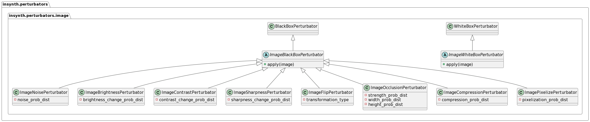
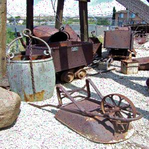
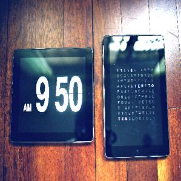
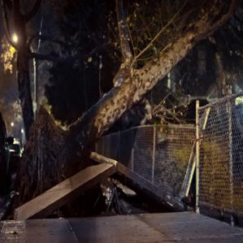
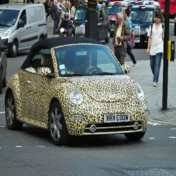
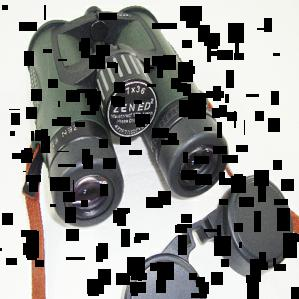
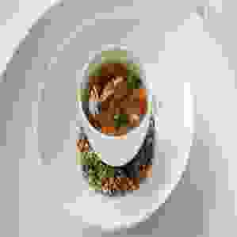

# Image Perturbators


All image-specific perturbators derive from the `BlackboxImagePerturbator` class. They take an `PIL` image as input and
return a transformed version of it.

## ImageNoisePerturbator

The ImageNoisePerturbator adds noise to an image. The probability distribution determines how much noise is added.

### Usage:

```python
from insynth.perturbators.image import ImageNoisePerturbator
from PIL import Image
from scipy.stats import norm

perturbator = ImageNoisePerturbator(noise_prob=norm, noise_prob_args={'loc': 0.01, 'scale': 0.005})
im = Image.open('image.jpg')
perturbed_im = perturbator.apply(im)
```

### Result



## ImageBrightnessPerturbator

The ImageBrightnessPerturbator changes the brightness of an image. The probability distribution determines how much the
brightness is changed.

### Usage:

```python
from insynth.perturbators.image import ImageBrightnessPerturbator
from PIL import Image
from scipy.stats import norm

perturbator = ImageBrightnessPerturbator(brightness_change_prob=norm,
                                         brightness_change_prob_args={'loc': 1, 'scale': 0.5})
im = Image.open('image.jpg')
perturbed_im = perturbator.apply(im)
```

### Result



## ImageContrastPerturbator

The ImageContrastPerturbator changes the contrast of an image. The probability distribution determines how much the
contrast is changed.

### Usage:

```python
from insynth.perturbators.image import ImageContrastPerturbator
from PIL import Image
from scipy.stats import norm

perturbator = ImageContrastPerturbator(contrast_change_prob=norm, contrast_change_prob_args={'loc': 1, 'scale': 0.5})
im = Image.open('image.jpg')
perturbed_im = perturbator.apply(im)
```

### Result


## ImageSharpnessPerturbator

The ImageSharpnessPerturbator changes the sharpness of an image. The probability distribution determines how much the
sharpness is changed.

### Usage:

```python
from insynth.perturbators.image import ImageSharpnessPerturbator
from PIL import Image
from scipy.stats import norm

perturbator = ImageSharpnessPerturbator(sharpness_change_prob=norm, sharpness_change_prob_args={'loc': 1, 'scale': 0.5})
im = Image.open('image.jpg')
perturbed_im = perturbator.apply(im)
```

### Result



## ImageFlipPerturbator

The ImageFlipPerturbator flips an image horizontally or vertically. There is no probability distribution for this
perturbator.

### Usage:

```python
from insynth.perturbators.image import ImageFlipPerturbator
from PIL import Image

perturbator = ImageFlipPerturbator()
im = Image.open('image.jpg')
perturbed_im = perturbator.apply(im)
```

### Result



## ImageOcclusionPerturbator

The ImageOcclusionPerturbator adds occlusion to an image. The probability distribution determines how much occlusion is
added. Also, a second and third probability distribution determines the size of each occlusion.

### Usage:

```python
from insynth.perturbators.image import ImageOcclusionPerturbator
from PIL import Image
from scipy.stats import norm

perturbator = ImageOcclusionPerturbator(strength_prob=norm, strength_prob_args={'loc': 0.01, 'scale': 0.005},
                                        width_prob=norm,
                                        width_prob_args={'loc': 10, 'scale': 5}, height_prob=norm,
                                        height_prob_args={'loc': 10, 'scale': 5}, color='#000000')
im = Image.open('image.jpg')
perturbed_im = perturbator.apply(im)
```

### Result



## ImageCompressionPerturbator

The ImageCompressionPerturbator adds compression artefacts to an image. The probability distribution determines how much
compression artefacts are added.

### Usage:

```python
from insynth.perturbators.image import ImageCompressionPerturbator
from PIL import Image
from scipy.stats import norm

perturbator = ImageCompressionPerturbator(artifact_prob=norm, artifact_prob_args={'loc': 0.5, 'scale': 0.2})
im = Image.open('image.jpg')
perturbed_im = perturbator.apply(im)
```

### Result



## ImagePixelizePerturbator

The ImagePixelizePerturbator pixelates an image. The probability distribution determines how much pixelation is added.

### Usage:

```python
from insynth.perturbators.image import ImagePixelizePerturbator
from PIL import Image
from scipy.stats import norm

perturbator = ImagePixelizePerturbator(pixelize_prob=norm, pixelize_prob_args={'loc': 0.2, 'scale': 0.1})
im = Image.open('image.jpg')
perturbed_im = perturbator.apply(im)
```

### Result


