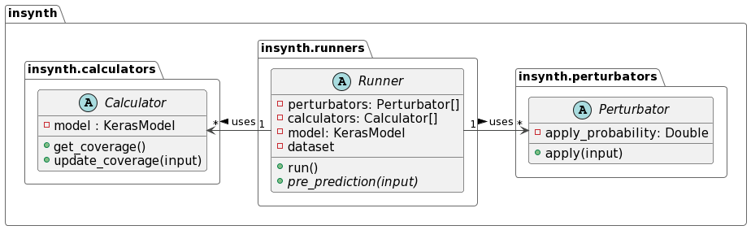

# Overview

The robustness of machine learning models is crucial to their safe and reliable operation in real-world applications. However, conducting robustness tests is hard as it requires evaluating the model under test repeatedly on different datasets.

*InSynth* provides an easy-to-use, efficient and reliable framework for conducting robustness tests.

It works by applying a set of domain-specific input generation techniques (image, audio or text) to the seed dataset, and then evaluating the model under test on the generated inputs. Then, a set of coverage criteria are evaluated to determine how well each dataset covers the model. Finally, a report is generated comparing the models' performance and coverage on different generated datasets.

The *InSynth* framework is divided into three components: perturbators, calculators and runners.

## Perturbators
Perturbators are used to generate inputs for the model under test.
They take a seed data as input, apply a data transformation function to it and return the mutated result.

In *InSynth*, all perturbator implementations derive from the common `Perturbator` base class depicted in the diagram above.
It provides a skeleton for implementing concrete perturbators.

For more information about which perturbators exist and how to use them, see [here](perturbators.md).

## Calculators
Calculators are used to calculate the coverage a test dataset achieves on a given model.
They take individual test cases as input and then update the internal coverage dictionary accordingly.
The achieved coverage can then be queried using the `get_coverage` method.

All calculator implementations derive from the abstract `Calculator` class (see diagram above).

For more information about which calculators exist and how to use them, see [here](calculators.md).

## Runners
Runners conduct robustness tests on ML models and generate easy-to-read reports.
They require a model as input as well as a list of perturbators and calculators which should be tested/evaluated.
Additionally, they require a dataset which should be used as a seed.
They evaluate the model under test on the seed dataset, apply the perturbators to the data individually and then reevaluate the model on each perturbed dataset.
Then, the models' performance and coverage are compared. 

All runner implementations derive from the abstract `Runner` class (see diagram above).

For more information about which runners exist and how to use them, see [here](runners.md).
