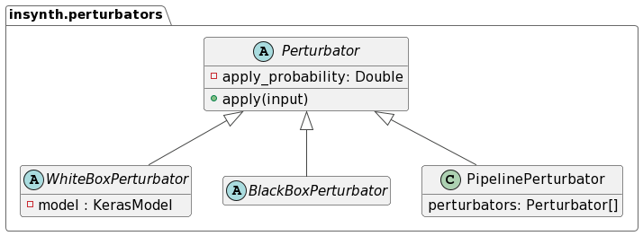

# Perturbators

All components which take an input example and return a transformed version of it are called perturbators in *InSynth*.

*InSynth* provides a set of abstract base classes as well as a set of concrete implementations of perturbators. The
common base class all perturbators derive from provides an empty skeleton for concrete implementations to use.


Additionally, the `WhiteBoxPerturbator`, `BlackBoxPerturbator` and `PipelinePerturbator` classes are provided.

- The `WhiteBoxPerturbator` class is the base class for perturbators which use knowledge about the models' internal
  structure during input generation.
- The `BlackBoxPerturbator` class is the base class for perturbators which can generate inputs without any external
  information.
- The `PipelinePerturbator` class is a concrete perturbator implementation which can be used to chain a list of existing
  perturbators. It is provided as it can conveniently be included in an existing testing workflow.

*InSynth* also provides a set of blackbox, domain-specific perturbator implementations for the image, audio and text
domains.

All perturbators provided by *InSynth* whose perturbation strength can be adjusted take a probability distribution as
input. During input generation, the perturbator samples from this distribution to determine the perturbation strength.

For more details on the image domain perturbators, see the [Image Perturbators](image_perturbators.md) section.

For more details on the audio domain perturbators, see the [Audio Perturbators](audio_perturbators.md) section.

For more details on the text domain perturbators, see the [Text Perturbators](text_perturbators.md) section.

## Pipeline Perturbator

The `PipelinePerturbator` class is a concrete perturbator implementation which can be used to chain a list of existing
perturbators. It can easily be integrated into an existing testing workflow to apply combinations of perturbators.

### Usage
```python
from insynth.perturbators.pipeline import PipelinePerturbator
from insynth.perturbators.image import ImageNoisePerturbator,ImagePixelizePerturbator
from PIL import Image

pert =  PipelinePerturbator([ImageNoisePerturbator(p=1.0), ImagePixelizePerturbator(p=1.0)])
image = Image.open('path/to/image.jpg')
mutated_image = pert.apply(image)
```