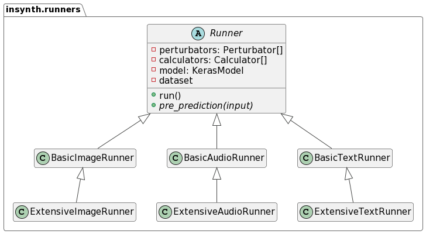

# Runners

Runners provide easy-to-use implementations for running robustness tests of ML models.

*InSynth* provides two concrete implementations for each domain. They are all based on the abstract `Runner` base class.



Each runner requires a model to test, the training and test datasets as generators as well as a list of perturbators and
calculators.

## BasicImageRunner

The BasicImageRunner conducts a robustness test of an image model given the dataset and list of perturbators and
calculators.

### Usage

```python
from insynth.runners import BasicImageRunner

runner = BasicImageRunner(list_of_perturbators, list_of_calculators, dataset_generator, dataset_y, model_to_test)

report = runner.run()
```

## ExtensiveImageRunner

The ExtensiveImageRunner conducts a robustness test of an image model given the dataset and utilizing all available
perturbators and calculators.

### Usage

```python
from insynth.runners import ExtensiveImageRunner

runner = ExtensiveImageRunner(dataset_generator, dataset_y, model_to_test, training_data_generator)

report = runner.run()
```

## BasicAudioRunner

The BasicAudioRunner conducts a robustness test of an audio model given the dataset and list of perturbators and
calculators.

### Usage

```python
from insynth.runners import BasicAudioRunner

runner = BasicAudioRunner(list_of_perturbators, list_of_calculators, dataset_generator, dataset_y, model_to_test)

report = runner.run()
```

## ExtensiveAudioRunner

The ExtensiveAudioRunner conducts a robustness test of an audio model given the dataset and utilizing all available
perturbators and calculators.

### Usage

```python
from insynth.runners import ExtensiveAudioRunner

runner = ExtensiveAudioRunner(dataset_generator, dataset_y, model_to_test, training_data_generator)

report = runner.run()
```

## BasicTextRunner

The BasicTextRunner conducts a robustness test of a text model given the dataset and list of perturbators and
calculators.

### Usage

```python
from insynth.runners import BasicTextRunner

runner = BasicTextRunner(list_of_perturbators, list_of_calculators, dataset_generator, dataset_y, model_to_test)

report = runner.run()
```

## ExtensiveTextRunner

The ExtensiveTextRunner conducts a robustness test of a text model given the dataset and utilizing all available
perturbators and calculators.

### Usage

```python
from insynth.runners import ExtensiveTextRunner

runner = ExtensiveTextRunner(dataset_generator, dataset_y, model_to_test, training_data_generator)

report = runner.run()
```
