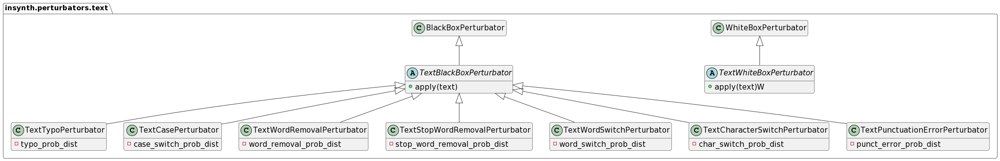

# Text Perturbators


All text-specific perturbators derive from the `BlackboxTextPerturbator` class. 
They take a string as input and return a mutated string.

## TextTypoPerturbator

The TextTypoPerturbator introduces typographic errors into the text.

### Usage

```python
from insynth.perturbators.text import TextTypoPerturbator
from scipy.stats import norm

perturbator = TextTypoPerturbator(typo_prob=norm, typo_prob_args={'loc': 0.2, 'scale': 0.2})
text = 'Hello, this is an example text.'
perturbed_text = perturbator.apply(text)
```

### Result

`this movie probably have ah $750 budget, and still manged to surpass Titanic. i rented this t day i crashed my mom's car, and it was the onlt thing that cheered ny up beyons belief!`
## TextCasePerturbator

The TextCasePerturbator switches the case of randomly selected words in the text.

### Usage

```python
from insynth.perturbators.text import TextCasePerturbator
from scipy.stats import norm

perturbator = TextCasePerturbator(case_switch_prob=norm, case_switch_prob_args={'loc': 0.2, 'scale': 0.1})
text = 'Hello, this is an example text.'
perturbed_text = perturbator.apply(text)
```

### Result

`This is oNe of the BesT mOviEs i'vE evER seen`
## TextWordRemovalPerturbator

The TextWordRemovalPerturbator removes randomly selected words from the text.

### Usage

```python
from insynth.perturbators.text import TextWordRemovalPerturbator
from scipy.stats import norm

perturbator = TextWordRemovalPerturbator(word_removal_prob=norm, word_removal_prob_args={'loc': 0.2, 'scale': 0.1})
text = 'Hello, this is an example text.'
perturbed_text = perturbator.apply(text)
```

### Result

`Indian cinema typifies  of two broad categories: they  either  honest  or the bad guys. The honest guys always shout at  top of their voice and fight  system  the bad cops enjoy for  part but suffer  the end.`
## TextStopWordRemovalPerturbator

The TextStopWordRemovalPerturbator removes randomly selected stop words from the text.

### Usage

```python
from insynth.perturbators.text import TextStopWordRemovalPerturbator
from scipy.stats import norm

perturbator = TextStopWordRemovalPerturbator(stop_word_removal_prob=norm, stop_word_removal_prob_args={'loc': 0.2, 'scale': 0.1})
text = 'Hello, this is an example text.'
perturbed_text = perturbator.apply(text)
```

### Result

`This one best movies I've ever seen`
## TextWordSwitchPerturbator

The TextWordSwitchPerturbator switches randomly selected words in the text.

### Usage

```python
from insynth.perturbators.text import TextWordSwitchPerturbator
from scipy.stats import norm

perturbator = TextWordSwitchPerturbator(word_switch_prob=norm, word_switch_prob_args={'loc': 0.2, 'scale': 0.1})
text = 'Hello, this is an example text.'
perturbed_text = perturbator.apply(text)
```

### Result

`The movie whole seems to show that boxing one is of the things that is bad his in life, him making his live life the that way is he it living, when but changes he, doesn he't leave boxing, he teaches others how to box. Thumbs Down.`
## TextCharacterSwitchPerturbator

The TextCharacterSwitchPerturbator switches randomly selected characters in the text.

### Usage

```python
from insynth.perturbators.text import TextCharacterSwitchPerturbator
from scipy.stats import norm

perturbator = TextCharacterSwitchPerturbator(char_switch_prob=norm, char_switch_prob_args={'loc': 0.2, 'scale': 0.1})
text = 'Hello, this is an example text.'
perturbed_text = perturbator.apply(text)
```

### Result

`It is constantly entertaining. And it cotnains a acreer-deifning role for Brosnan as the lonely hit-man looking for normalcy, friendship and a means to do at least one good thing in his life.`
## TextPunctuationErrorPerturbator

The TextPunctuationErrorPerturbator introduces punctuation errors into the text.

### Usage

```python
from insynth.perturbators.text import TextPunctuationErrorPerturbator
from scipy.stats import norm

perturbator = TextPunctuationErrorPerturbator(punct_error_prob=norm, punct_error_prob_args={'loc': 0.2, 'scale': 0.1})
text = 'Hello, this is an example text.'
perturbed_text = perturbator.apply(text)
```

### Result
`Without analyzing the many relevant themes I'll just say, if you haven't seen it, do yourself a favor and check it out; Sometime's the down–to–earth, slice–of–life movies are the best and this is a great one.`
